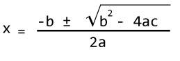

# פותר משוואות - שלב ב

כתבו מערכת הפותרת משוואות.

בשלב ב עליכם לכתוב מימוש מלא של המחלקה. 
המימוש צריך לעבור את כל הבדיקות - שלכם ושלנו.

אנחנו מריצים את הפקודה הבאה:

	make test && ./test

* [Reference source](https://www.programiz.com/cpp-programming/examples/quadratic-roots)

* [Reference source](https://fahad-cprogramming.blogspot.com/2017/07/complex-numbers-class-cpp-example.html)

*For a quadratic equation ax2+bx+c = 0 (where a, b and c are coefficients), it's roots is 
	-given by following the formula.
 :
 
*The term b2-4ac is known as the discriminant of a quadratic equation.

*The discriminant tells the nature of the roots.

*If discriminant is greater than 0, the roots are real and different.

*If discriminant is equal to 0, the roots are real and equal.

*If discriminant is less than 0, the roots are complex and different.
:

